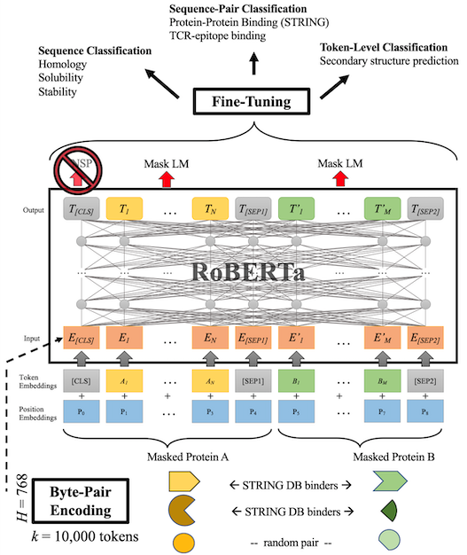

[](https://travis-ci.com/PaccMann/paccmann_proteomics)

# paccmann_proteomics

PaccMann Protein Language Modeling for: Protein Classification, Protein-Protein Binding and Protein Sequence Annotation Tasks.

Life science practitioners are drowning in unlabeled protein sequences. Natural Language Processing (NLP) community has recently embraced self-supervised learning as a powerful approach to learn representations from unlabeled text, in large part due to the attention-based context-aware Transformer models. In a transfer learning fashion, expensive pre-trained universal embeddings can be rapidly fine-tuned to multiple downstream prediction tasks.

In this work we present a modification to the RoBERTa model by inputting a mixture of binding and non-binding protein sequences (from STRING database) during pre-training with the Masked Language Modeling (MLM) objective.

Next, we compress protein sequences by 64% with a Byte Pair Encoding (BPE) vocabulary consisting of 10K tokens, each 3-4 amino acids long.

Finally, to expand the model input space to even larger proteins and multi-protein assemblies, we pre-train Longformer models that support 2,048 tokens.

Our approach produces excellent fine-tuning results for protein-protein binding prediction, TCR-epitope binding prediction, cellular-localization and remote homology classification tasks. We suggest that the Transformer's attention mechanism contributes to protein binding site discovery.

## Installation

Use conda:

```console
conda env create -f conda.yml
```

Activate the environment:

```console
conda activate paccmann_proteomics
```

You are good to go and `paccmann_proteomics` is installed in editable mode for development:

```python
import paccmann_proteomics
```

## Model Architecture



An examplary RoBERTa architecture is pre-trained by a mixture of binding and non-binding protein sequences, using only the MLM objective. Byte-pair encoding with a 10k token vocabulary enables inputting 64% longer protein sequences compared to character level embedding. `E_i` and `T_i` represent input and contextual embeddings for token `i`. `[CLS]` is a special token for classification-task output, while `[SEP]` separates two non-consecutive sequences.

## Info

Pre-print with current status of the project can be found [here](https://www.overleaf.com/read/nkbwcfsswbmy).

Scripts for model training and evaluation described in the pre-print can be found [here](./scripts).
Related configuration files can be found [here](./training_configs).

Raw data and models will be soon available. Contact [us](mailto:mfilipav@gmail.com,drugilsberg@gmail.com,joriscadow@gmail.com) if you need them now :smiley:.
